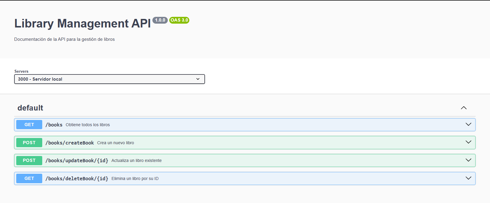
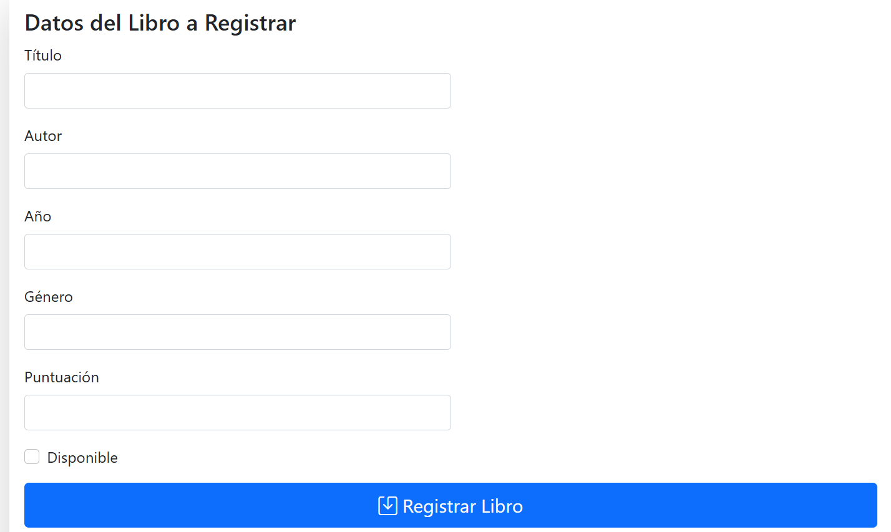
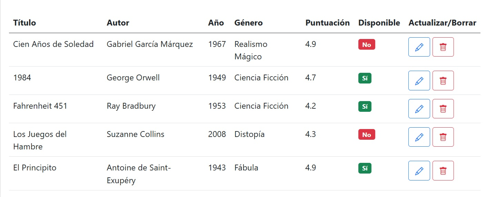

# 📚 Basic CRUD for Library Management



---
## Descripción

Esta es aplicación CRUD básica para la gestión de libros usando Node.js, Express, MongoDB y Mongoose. 
Aquí te muestro cómo se ve la aplicación:



## 🚀 Características

✅ Crear, leer, actualizar y eliminar registros de libros.
✅ API RESTful sencilla para pruebas o aprendizaje.
✅ Conexión a base de datos MongoDB local.
✅ Variables de entorno gestionadas con `dotenv`.

---

## 🛠️ Tecnologías

* Node.js
* Express
* MongoDB
* Mongoose
* Dotenv

---

## ⚙️ Instalación y Ejecución

1. Clona el repositorio:

```bash
git clone https://github.com/itsPatH/crud-project.git
cd crud-project
```

2. Instala las dependencias:

```bash
npm install
```

3. Configura el archivo `.env`:

```env
PORT=3000
MONGO_URL=mongodb://127.0.0.1:27017/db_books
```

4. Asegúrate de tener **MongoDB** corriendo en tu máquina.

5. Inicia la aplicación:

```bash
nodemon app.js
```

La API estará disponible en: [http://localhost:3000](http://localhost:3000)

---

## 📦 Rutas de la API

| Método | Ruta         | Descripción              |
| ------ | ------------ | ------------------------ |
| GET    | `/books`     | Obtener todos los libros |
| POST   | `/books`     | Crear un nuevo libro     |
| GET    | `/books/:id` | Obtener un libro por ID  |
| PUT    | `/books/:id` | Actualizar un libro      |
| DELETE | `/books/:id` | Eliminar un libro        |

---

## 📝 Ejemplo de un Libro

```json
{ 
title: "1984"
author: "George Orwell"
year: 1949
availability: true
genre: "Ciencia Ficción"
rating: 4.7
}
```

---

## 📢 Notas

* La aplicación está pensada como un proyecto de aprendizaje.
* Se recomienda usar herramientas como **Postman** para probar los endpoints.

---

## 🤝 Contribuciones

¡Las contribuciones son bienvenidas! Puedes enviar un Pull Request o abrir un Issue.

---

## 📄 Licencia

Este proyecto se distribuye bajo la licencia MIT.
